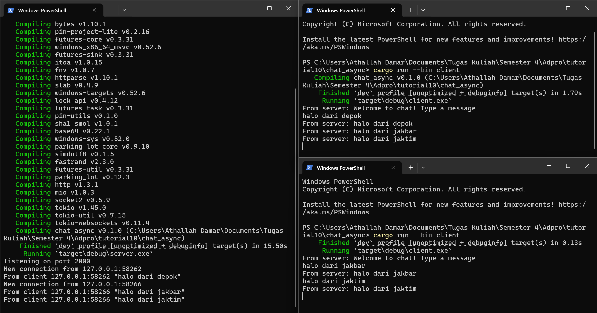
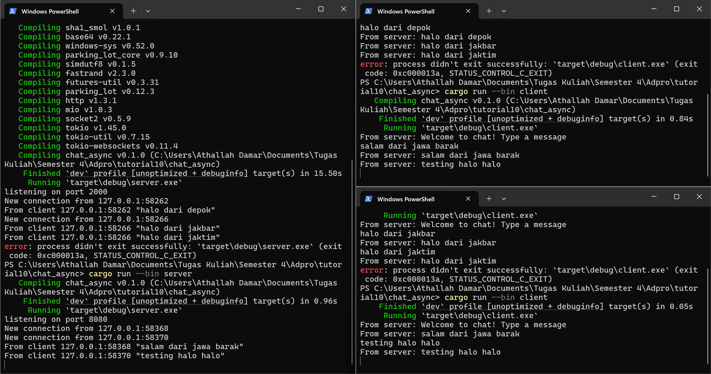
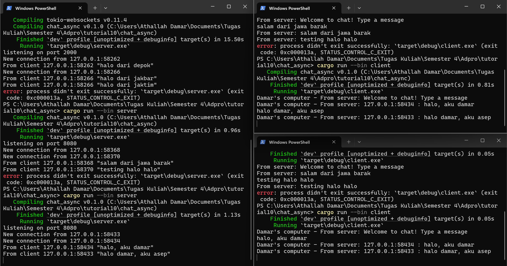

# Advprog-modul10-BroadcastChat

Nama: Athallah Damar Jiwanto  
NPM: 2306245024  
Kelas: Advprog-B

## Experiment 2.1: Original code, and how it run

Pada tahap ini, Saya menguji aplikasi chat WebSocket dengan satu server (port 2000) dan tiga client. Semua client dapat terhubung, bertukar pesan, dan menerima pesan secara serempak tanpa hambatan karena komunikasi berlangsung asynchronous. Setiap pesan yang dikirim oleh satu client langsung diteruskan ke client lain, membuktikan fitur broadcast berjalan lancar. Hasil ini memperlihatkan bahwa tokio_websockets dan channel broadcast dari tokio efektif untuk membangun chat real-time yang sederhana.

## Experiment 2.2: Modifying Port

Sebagai percobaan, port untuk WebSocket di server dan client diubah dari 2000 menjadi 8080. Pengaturan ini dilakukan pada TcpListener::bind di server serta ClientBuilder::from_uri di sisi client. Setelah perubahan, aplikasi tetap berjalan normal dan komunikasi real-time antar client tidak terganggu. Ini membuktikan bahwa port hanyalah titik akses, dan selama alamat serta protokol sesuai, koneksi tetap terjalin. Protokol WebSocket tetap dipakai tanpa mengubah logika pengiriman pesan di aplikasi.

## Experiment 2.3: Small changes, add IP and Port

Pada percobaan ini, setiap pesan yang diterima client kini disertai informasi IP dan port pengirim. Hal ini dicapai dengan mengubah bagian server, tepatnya pada bcast_tx.send(...), agar menyisipkan data addr yang berisi alamat dan port client pengirim. Dengan cara ini, client dapat mengetahui sumber pesan meskipun belum ada fitur identitas atau username. Selain itu, tampilan pesan di client juga diperjelas dengan menambahkan prefix "Damar's Computer - From server:" sehingga mudah membedakan pesan masuk dan pesan sendiri. Percobaan ini menunjukkan bagaimana detail tambahan seperti alamat socket dapat memberikan konteks lebih pada komunikasi sederhana.